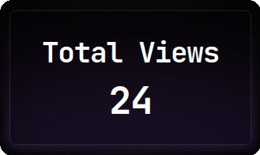

# AWS Cloud Resume Challenge

This repository contains the code for the [Cloud Resume Challenge](https://cloudresumechallenge.dev/docs/the-challenge/aws/) project using AWS.


## Running the project

1. Clone the repository.

```bash
git clone https://github.com/nuanv/cloud-resume-project.git
cd cloud-resume-project
```

3. Copy the example terraform var file `example_terraform.tfvars` to `terraform.tfvars`.

```bash
cp example_terraform.tfvars terraform.tfvars
```

> [!NOTE]
> Install Terraform and aws-cli before proceeding further. </br>
> Run `aws configure` and provide required credentials for the user account. </br>
> Change the variables in `terraform.tfvars` according to your preference.

3. Initialize a working directory containing config files and install plugins for required providers.

```bash
terraform init
```
4. First we will run our `function module` which will setup the API gateway, Lambda function and DynamoDB.

> [!WARNING]
> While the terraform deployment allows you to choose region of your choice, make sure you change the region in `modules/function/function.ts` to the region of your choice.

```bash
terraform apply -target=module.function
```
5. Once the infrastructure is deployed you will receive api invoke URL in your terminal. Change the url in `src/app/api/getViews.ts` to the url you received.

```ts
const API_URL = '<API Gateway Invoke URL>';
```

6. Install required packages & Build static files for our website.

```bash
npm install
npm run export
```

7. Now we will run our `website module` which will setup the S3 bucket and cloudflare DNS.

```bash
terraform apply -target=module.website
```

8. To bring down the whole infrastructure run.

```bash
terraform destroy
```

## Visit your domain & Reload page to update view count


